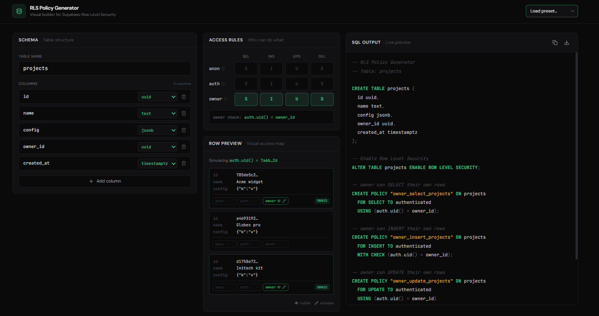

# RLS Policy Generator

A visual builder for **Supabase Row Level Security** policies. Define your table, toggle access per role, and copy production-ready SQL - without typing a single `auth.uid()` by hand.

> **Live demo:** https://rls-policy-generator.vercel.app



## Why

Supabase's row-level security is one of the most powerful features in Postgres, but writing the SQL is repetitive and easy to get wrong:

- Forgetting `WITH CHECK` on `INSERT` / `UPDATE`
- Mixing up `USING` and `WITH CHECK` semantics
- Inconsistent policy naming
- Skipping `ALTER TABLE … ENABLE ROW LEVEL SECURITY` entirely

This tool generates the boilerplate for you, explains in plain English what each policy permits, and flags risky configurations while you are still setting them up. The row preview shows exactly which rows each role can read and write.

There is a longer write-up of the design decisions in [CASE_STUDY.md](./CASE_STUDY.md).

## Features

- **Schema builder** with typed columns, and live validation against Postgres identifier rules (reserved key words, invalid characters, duplicates, the 63 byte limit)
- **Access matrix** toggling SELECT / INSERT / UPDATE / DELETE per role (`anon`, `authenticated`, `owner`)
- **Posture readout** in the header, reading the whole config at a glance: policy count, warning count, or the errors blocking generation
- **Inline risk warnings** the moment a config exposes every row, not after you generate
- **Plain-English annotations** on every generated policy, written into the SQL as comments so they survive into your migration
- **Row scoping** by owner column (`user_id`, `owner_id`, `created_by`) or by org membership through a join table
- **Row preview** simulating `auth.uid()` and showing per row whether each role can SELECT, INSERT, UPDATE or DELETE it
- **Live SQL output**, syntax-highlighted, with line numbers, copy and download
- **Diff highlighting** flashing exactly the lines a toggle just changed
- **Command palette** on `⌘K` covering presets, every toggle, row scope and the copy, download and schema actions
- **Built-in guide** on `?` explaining RLS from scratch: what it is, why mistakes are silent, the roles, the operations, `USING` vs `WITH CHECK`, org scoping, how to run the output, and a pre-ship checklist
- **In-context help** on every role, operation, panel and the row scope, so you can learn the concept without leaving what you are doing
- **Shareable links** encoding the full schema and toggle state in the URL, with no backend
- **Preset templates** for Blog, SaaS, Ecommerce, Public Read-Only, Private Notes and Multi-Tenant SaaS

## Tech stack


- **Next.js 14** App Router
- **TypeScript**
- **Tailwind CSS** with a custom dark theme (`#0a0a0b` base, `#3ECF8E` accent)
- **shadcn/ui** patterns (lightweight, no runtime deps)
- **lucide-react** icons
- **DM Sans** + **JetBrains Mono** typography

## Run locally

```bash
npm install
npm run dev
```

Open [http://localhost:3000](http://localhost:3000).

## Deploy to Vercel

```bash
npm i -g vercel    # one-time CLI install
vercel             # preview deployment
vercel --prod      # production deployment
```

Or push to GitHub and import the repo from [vercel.com/new](https://vercel.com/new).

## File structure

```
rls-policy-generator/
├── app/
│   ├── globals.css
│   ├── layout.tsx
│   └── page.tsx
├── components/
│   ├── ui/
│   │   ├── empty-state.tsx
│   │   ├── info-popover.tsx
│   │   ├── panel.tsx
│   │   └── skeleton.tsx
│   ├── access-rules.tsx
│   ├── command-palette.tsx
│   ├── guide.tsx
│   ├── header.tsx
│   ├── hero.tsx
│   ├── posture-badge.tsx
│   ├── preset-selector.tsx
│   ├── row-preview.tsx
│   ├── schema-builder.tsx
│   ├── share-button.tsx
│   └── sql-output.tsx
├── lib/
│   ├── access.ts
│   ├── annotations.ts
│   ├── diff.ts
│   ├── help.ts
│   ├── posture.ts
│   ├── presets.ts
│   ├── risks.ts
│   ├── sample-data.ts
│   ├── sql-generator.ts
│   ├── syntax-highlighter.ts
│   ├── types.ts
│   ├── url-state.ts
│   ├── utils.ts
│   └── validation.ts
└── public/
```

## License

MIT
